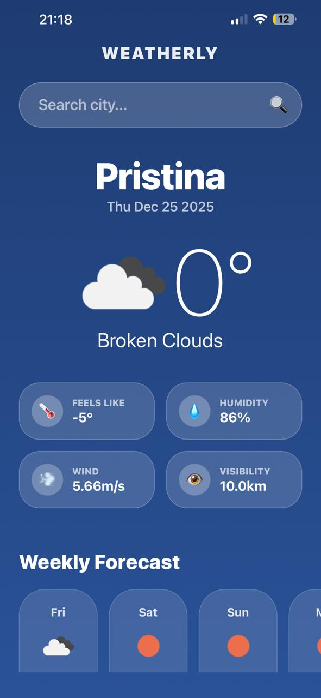
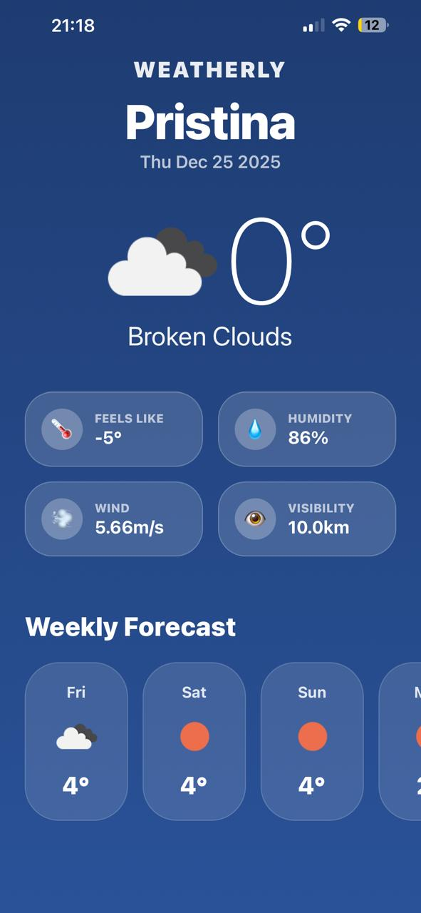
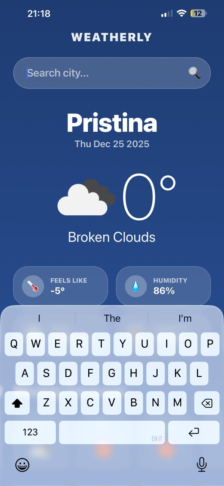
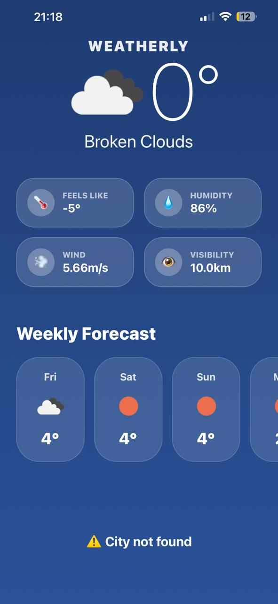

# 🌤️ Weatherly – Weather App

## 📘 Project Overview
**Weatherly** is a mobile application built with **React Native** and **Expo**, using the **OpenWeatherMap API** to display real-time weather data.  
The project was developed as part of the **Mobile Application Development** course at the **University of Mitrovica**.

---

## 🎯 Project Objective
The goal of this project is to demonstrate:
- Integration with external APIs
- Proper state management in React Native
- Handling loading, success, and error states
- Building a clean and user-friendly mobile interface

---

## ✨ Key Features

- 🔍 Search weather by city name  
- 🌡️ Display current temperature  
- 💨 Wind speed, humidity, and “feels like” temperature  
- 📅 5-day weather forecast  
- ⏳ Loading indicator while fetching data  
- ⚠️ Error handling for invalid city names or network issues  
- 🎨 Modern UI with animations and gradients  

---

## 🧠 Technologies Used

- **React Native**
- **Expo**
- **OpenWeatherMap API**
- **JavaScript (ES6+)**
- **React Hooks** (`useState`, `useEffect`, `useCallback`, `useRef`)
- **Animated API**
- **Expo Linear Gradient**

---

## 🧩 Application Structure

- `App.js` – Main application component  
- `WeatherDetail` – Displays detailed weather information  
- `ForecastList` – Displays 5-day weather forecast  
- State management using React Hooks  
- API communication using `fetch()`

---

## 🔄 State Management

| State   | Description                               |
|---------|-------------------------------------------|
| Loading | Shown while fetching data                 |
| Success | Weather data displayed successfully       |
| Error   | Displayed when API request fails          |

---

## 🖥️ Application Overview

| Feature     | Description                                  |
|-------------|----------------------------------------------|
| Main Screen | Shows current temperature and weather        |
| Forecast    | Horizontal 5-day weather forecast            |
| Search      | Input field to search any city               |

---

## 📸 Application Screenshots

| Home Screen | 5-Day Forecast | Search | Error Handling |
|------------|----------------|--------|----------------|
|  |  |  |  |

---

## 🚀 How to Run the Project
    ```bash
    git clone https://github.com/your-username/weatherly-app.git
    cd weatherly-app
    npm install
    npx expo start

## Environment Setup

- Create a .env file in the root directory:

    - EXPO_PUBLIC_WEATHER_API_KEY=your_api_key_here

## ✅ Requirements Fulfilled
- Requirement	Status
- API Integration	✅
- 5-Day Forecast	✅
- Search Functionality	✅
- Loading & Error Handling	✅
- Clean UI & UX	✅
- Well-structured Code	✅

## 👨‍💻 Author
- Rinesa Bislimi
- Course: Mobile Application Development
- University of Mitrovica

## 🏁 Conclusion

- This project successfully demonstrates how to build a real-world weather application using React Native and public APIs.
- It fulfills all course requirements and showcases clean code, solid architecture, and a professional user interface.


